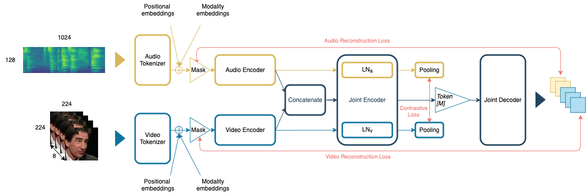

# Social-MAE: Audiovisual Masked AutoEncoder for Human Social Interactions

## Introduction
<p align="center"></p>

This repository contains the implementation of Social-MAE proposed in our [FG 2024 paper](not_available_yet).

Social-MAE is a pre-trained audiovisual Masked Autoencoder based on an extended version of Contrastive Audio-Visual Masked Auto-Encoder (CAV-MAE), which is pre-trained on audiovisual social data. Specifically, we modify CAV-MAE to receive a larger number of frames as input and pre-train it on a large dataset of human social interaction (VoxCeleb2) in a self-supervised manner. The model achieves state-of-the-art results on multimodal emotion recognition and laughter recognition and competitive results for apparent personality estimation.

## Citing
Please cite the following paper.
```  
@inproceedings{
    in-press
}
```

## Model
The *social-mae* models are defined in `src/models/social_mae.py` and include two variants:

* `SOCIALMAE`: This model is designed for pretraining purposes and includes a decoder component. It is intended to learn robust representations from paired audio and image data, which can be used to initialize models for downstream tasks.
* `SOCIALMAEFT`: This model is optimized for finetuning on specific tasks and does not include a decoder. It builds on the pretrained representations to perform task-specific adjustments.

## Input Specifications

Both models, `SOCIALMAE` and `SOCIALMAEFT`, require inputs comprising pairs of audio and image data:

* Audio Input: The audio input should have the shape [batch size, length_in_frame, mel_bin_num], where:
        batch size is the number of audio samples in a batch.
        length_in_frame specifies the duration of the audio in terms of the number of frames.
        mel_bin_num is the number of Mel frequency bins.

    Example shape: [batch size, 1024, 128].

* Image Input: The image input should be in the format [batch size, channel_num, height, width, duration], where:
        batch size is the number of images in a batch.
        channel_num refers to the number of color channels.
        height and width denote the dimensions of each image, commonly 224 x 224.
        duration indicates the number of frames in the video or sequence context, in this case 8 for temporal data.

    Example shape: [batch size, 3, 224, 224, 8].

## Pretraining
Before running any experiments, ensure that you have installed all the required packages for this project (eventually in a separate virtual environment):
```
pip install -r requirements.txt
```

To begin pretraining the model using your audio and video data, execute the following command:
```
python src/main_pretrain.py --data-video path/to/video/data --data-audio path/to/audio/data --dataset MyDataset
```

## Human Social Interaction Tasks
To finetune the model using your audio and video data, you will need a custom dataloader and a pretrained checkpoint. Run:
```
python src/main_ft.py ----data-video path/to/video/data --data-audio path/to/audio/data --dataset MyDataset --pretrained-checkpoint path/to/checkpoint.pth
```

To run inference:
```
python src/main_ft.py ----data-video path/to/video/data --data-audio path/to/audio/data --dataset MyDataset --pretrained-checkpoint path/to/checkpoint.pth --no-training
```

## Pretrained and Finetuned Models
Pretained checkpoints are available at:

|      Model Name     | Pretrain Data | Finetuned Data | Batch Size | Lambda_c |   Masking Ratio  |  FPS  |  Duration (s)  |
|:-------------------:|:-------------:|:-------------:|:----------:|:--------:|:----------------:|:-----:|:----------:|
|   **[Social-MAE](not_available_yet)** <br /> | VoxCeleb2 | n.a. |     36    |   0.01   | 75% Unstructured | 2 | 4 |
|   **[Social-MAE-FT](not_available_yet)** <br /> | VoxCeleb2 | CREMA-D |     12    |   0.01   | 75% Unstructured | 2 | 4 |
|   **[Social-MAE-FT](not_available_yet)** <br /> | VoxCeleb2 | ChaLearn FI |     8    |   0.01   | 75% Unstructured | 2 | 4 |
|   **[Social-MAE-FT](not_available_yet)** <br /> | VoxCeleb2 | NDC-ME |     8    |   0.01   | 75% Unstructured | 2 | 4 |

## Contact
If you have a question, please bring up an issue (preferred) or send me an email [hugo.bohy@umons.ac.be](hugo.bohy@umons.ac.be).